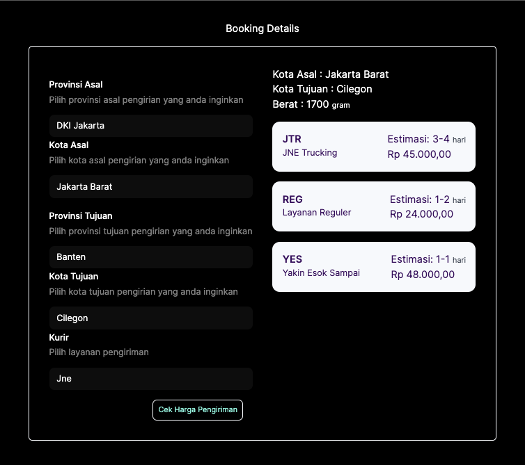
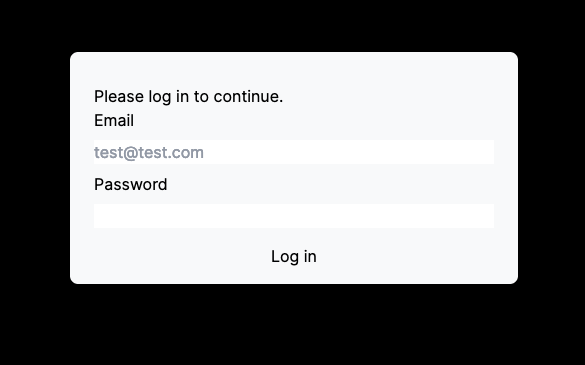

# Cek Ongkir Pengiriman Logistik Sederhana Menggunakan Reactjs | Nextjs 14 

Menampilkan perbandingan biaya pelayanan logistik antara JNT, POS, dan TIKI. menggunakan api dari `rajaongkir.com`




## Key Point

- [x]  fetch Data dari external API (contoh: https://rajaongkir.com/dokumentasi/starter)
- [x]  Conditional Rendering
- [x]  Reusable Component
- [x]  Reactivity
- [x]  gunakan eslint
- [x]  gunakan css / sass / scoped style / styled component dengan maksimal
- [x]  gunakan Next.JS
- [x]  penggunaan typescript menjadi nilai tambah
- [x]  Routing (Auth)

### Fetch Data external

Integrasi API `rajaongkir` tidak menyulitkan, dari segi dokumentasi juga cukup jelas, saya memanfaatkan fitur baru di versi 14 ini menggunakan `server components`, yang mana ini serupa dengan `React Query`.
berikut implementasi sederhana pada file `app/lib/actions`.

```typescript
export async function getDataProvince() {
  const res = await fetch(`${process.env.RAJAONGKIR}/province`, {
    headers: {
      key: `${process.env.SECRETKEY}`,
    },
  });
  // The return value is *not* serialized
  // You can return Date, Map, Set, etc.

  if (!res.ok) {
    // This will activate the closest `error.js` Error Boundary
    throw new Error("Failed to fetch data");
  }
  return res.json();
}

...
```
dan mudah digunakan memnaggil data secara paralel seperti berikut

```typescript
const dataProvince = await getDataProvince();
  const dataCity = await getDataCity();
  const [province, city] = await Promise.all([dataProvince, dataCity]);
```

### Conditional Rendering, Reusable, Reactivity

berikut beberapa contoh program yang menerapkan perihal diatas terdapat pada file didalam folder `components`

```typescript
// komponen yang reusable dan reactivity 

import * as React from "react";

interface buttonPrimary {
    label: string,
    type?:string,
    disabled?: boolean,
}
type ButtonProps = buttonPrimary & React.ButtonHTMLAttributes<HTMLButtonElement>;

export const PrimaryButton = React.forwardRef<HTMLButtonElement, ButtonProps>(
    ({label,type,disabled, ...rest}, ref) => {
        return (
          <button disabled={disabled} type={type} ref={ref} className="p-2 w-auto outline outline-2 outline-slate-50 text-teal-200 hover:text-black hover:bg-slate-50 text-xs rounded-md" {...rest}>{label}</button>
        )
      }
) 

PrimaryButton.displayName = "PrimaryButton";


// cara penggunaan
<PrimaryButton type="submit" label="Cek Harga Pengiriman" disabled={pending}/>
```

### Routing AUTH

Auth kali ini sederhan menggunakan credential berikut ini, email `test@test.com` dan password `123test`, pada app berikut memakai middleware untuk memprotect halaman utama




## Getting Started

First, run the development server:

```bash
npm run dev
# or
yarn dev
# or
pnpm dev
# or
bun dev
```

Open [http://localhost:3000](http://localhost:3000) with your browser to see the result.

You can start editing the page by modifying `app/page.tsx`. The page auto-updates as you edit the file.

This project uses [`next/font`](https://nextjs.org/docs/basic-features/font-optimization) to automatically optimize and load Inter, a custom Google Font.

